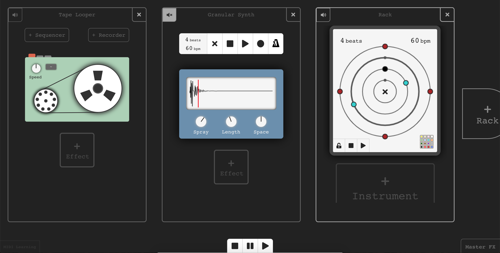

# Minim

Readme below was written for my final year project at university, which was submitted April 8th 2019.
The commit containing that code has hash 37d173a.

Some minor tweaks have been made to remove the paid version of FontAwesome and replace with Heroicons.

Otherwise the project is kept as-is to reflect how it behaved for my dissertation, warts and all!

Notably, it's built quite differently to how I'd build an app like this today, with more commercial experience.

---

Inspired by the minimalist music of Steve Reich, *Minim* is a playground for making music with loops, samples and powerful included effects.

Features include:
* Audio loop trimming & real-time speed control
* Recording and sequencing patterns of arbitrary samples
* Multiple independent time signatures
* Sequenceable polyphonic synthesiser with twin oscillators, filters, envelopes and an LFO
* Innovative sample-based granular synthesis
* Individual and global effects processors
* Fully integrated MIDI-based hardware control with learning

## Running the App
Steps:
- Change directory into the root of the Git repository
- Run `yarn install`
- Run `yarn start`
- Minim should pop open in a browser automatically
